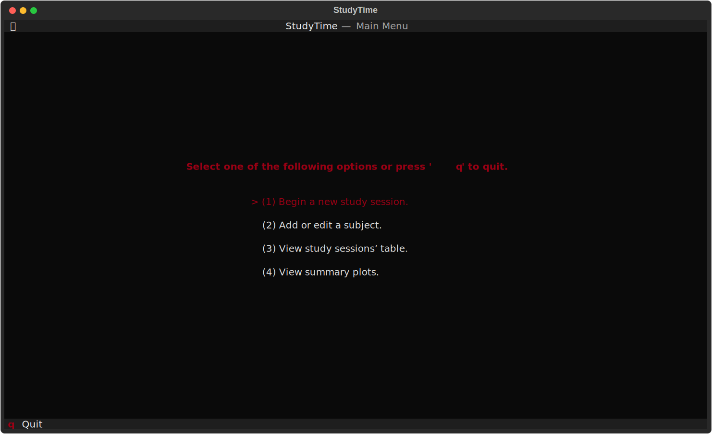
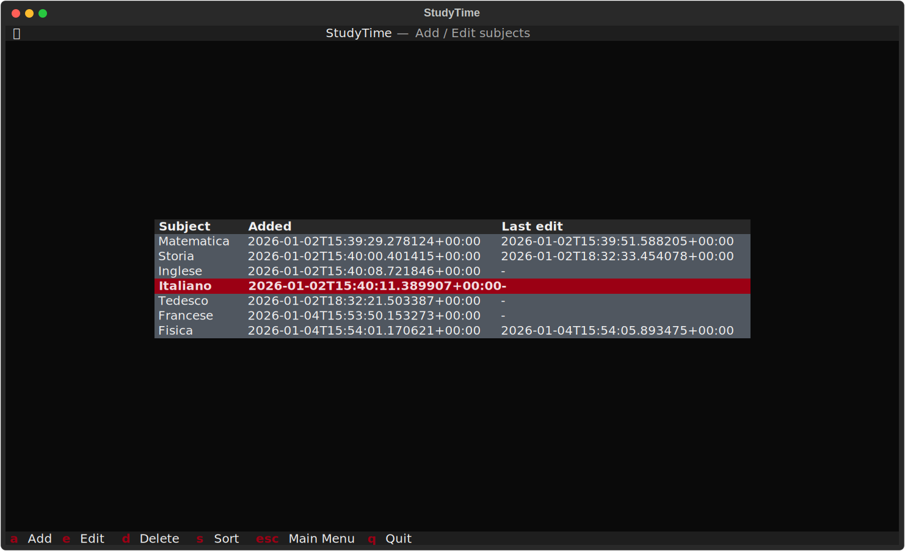
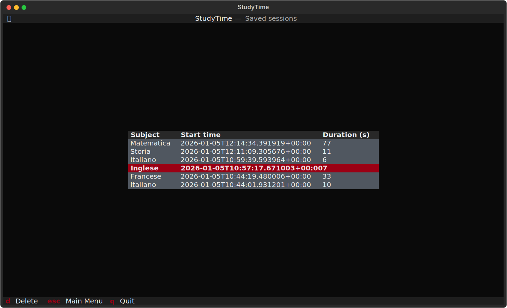

# StudyTime TUI

StudyTime is a simple TUI application, written in Python and powered by the [Textual](https://textual.textualize.io/) library, to record study sessions and show related statistics.
It is heavily inspired by the pure terminal version made by [bartdazz](https://github.com/bartdazz/StudyTime).

## Installation

### `pip`

Install the required packages:

```sh
pip install --upgrade textual textual-plotext
```

Then, you can clone this repository and execute `main.py`.

### `uv`

This project was developed with [uv](https://docs.astral.sh/uv/).
After cloning the repository, you can use `uv` to install the required dependencies in a `venv` and run the main script.

```sh
uv run main.py
```

## Feature roadmap

- [x] Change colour scheme in-app
- [x] Add, edit and delete subjects
- [x] Track study sessions by subject
- [x] Delete study sessions
- [ ] Export sessions’ log to CSV
- [ ] Show summary plots
- [ ] Tweak default behaviours via JSON configuration file

## Screenshots

| Screen                | Screenshot (with default theme)                          |
| --------------------- | -------------------------------------------------------- |
| Main menu             |      |
| Study session tracker |       |
| Subjects’ manager     |        |
| Sessions viewer       |  |
